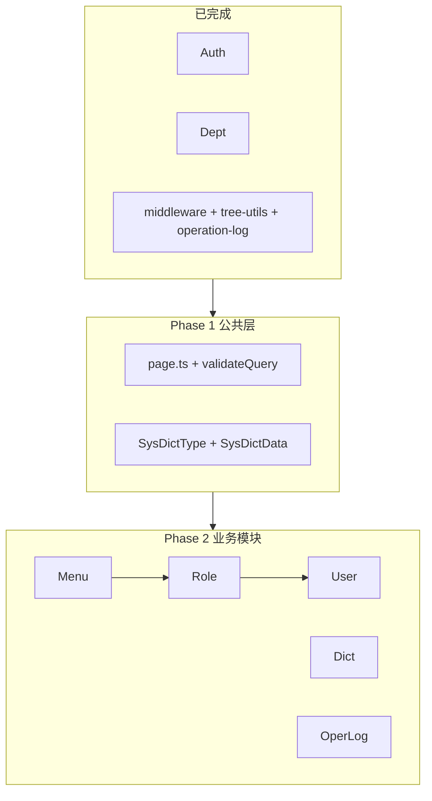

# Express 剩余模块翻译计划

## 现状

| 已完成 | 待实现 |
|--------|--------|
| Auth (3 API) | User (6 API) |
| Dept (4 API) | Role (6 API) |
| 中间件 + 操作日志写入 | Menu (4 API) |
| Prisma 7 张表 | Dict (8 API) |
| | OperLog 读 (1 API) |

前端 [`web/src/api/`](web/src/api/) 已定义全部路径，**不改前端**，只需 Express 对齐 Java 契约。



## Phase 0: 公共分页层（前置）

Java [`PageQuery`](src/main/java/com/zhihao/admin/common/api/PageQuery.java) / [`PageResult`](src/main/java/com/zhihao/admin/common/api/PageResult.java) 在 Express 侧尚无对应物，User/Role/Dict/OperLog 都依赖它。

新增 [`server/src/common/page.ts`](server/src/common/page.ts)：

```typescript
// PageResult 结构对齐前端 types.ts
{ total, pageNum, pageSize, records }
```

新增 [`server/src/middleware/validate.ts`](server/src/middleware/validate.ts) 扩展 `validateQuery(schema)`：

- `pageNum` 默认 1，最小 1
- `pageSize` 默认 10，最大 100

辅助函数 `toPageResult(total, pageNum, pageSize, records)` + `parsePageQuery(query)` 供各 service 调用。

## Phase 1: Prisma 补 Dict 模型

[`server/prisma/schema.prisma`](server/prisma/schema.prisma) 新增两张表（对齐 [`schema.sql`](src/main/resources/db/schema.sql) L85-112）：

- `SysDictType` → `sys_dict_type`
- `SysDictData` → `sys_dict_data`

执行 `pnpm prisma generate`，不跑 migrate。

## Phase 2: Menu 模块（4 API）

对标 [`MenuController`](src/main/java/com/zhihao/admin/module/system/controller/MenuController.java) + [`MenuService`](src/main/java/com/zhihao/admin/module/system/service/MenuService.java)。

| 方法 | 路径 | 权限 |
|------|------|------|
| GET | `/api/system/menus/tree` | `system:menu:list` 或 `system:role:menus` |
| POST | `/api/system/menus` | `system:menu:add` |
| PUT | `/api/system/menus/:id` | `system:menu:edit` |
| DELETE | `/api/system/menus/:id` | `system:menu:delete` |

新增文件：
- [`server/src/modules/menu/menu.schema.ts`](server/src/modules/menu/menu.schema.ts) — zod + `MenuTreeNode` 类型
- [`server/src/modules/menu/menu.service.ts`](server/src/modules/menu/menu.service.ts)
- [`server/src/modules/menu/menu.routes.ts`](server/src/modules/menu/menu.routes.ts)

关键逻辑（直接移植 Java）：
- `tree()` 复用 [`buildTree`](server/src/common/tree-utils.ts)
- `menuType=B` 必须有 `permission`；`menuType=C` 必须有 `path`
- 更新禁止 `id === parentId`；删除检查子节点

## Phase 3: Role 模块（6 API）

对标 [`RoleController`](src/main/java/com/zhihao/admin/module/system/controller/RoleController.java) + [`RoleService`](src/main/java/com/zhihao/admin/module/system/service/RoleService.java)。

| 方法 | 路径 | 权限 |
|------|------|------|
| GET | `/api/system/roles` | `system:role:list` 或 user add/edit |
| POST | `/api/system/roles` | `system:role:add` |
| PUT | `/api/system/roles/:id` | `system:role:edit` |
| DELETE | `/api/system/roles/:id` | `system:role:delete` |
| GET | `/api/system/roles/:id/menus` | `system:role:menus` |
| PUT | `/api/system/roles/:id/menus` | `system:role:menus` |

新增 `server/src/modules/role/{schema,service,routes}.ts`

关键逻辑：
- 分页按 `sort` 升序
- `roleCode` 唯一校验
- 删除：改 `roleCode` 为 `{code}:{id}` → 清 `sys_role_menu` + `sys_user_role` → 逻辑删
- 菜单分配：先删后插（`menuIds` 去重）

## Phase 4: User 模块（6 API）

对标 [`UserController`](src/main/java/com/zhihao/admin/module/system/controller/UserController.java) + [`UserService`](src/main/java/com/zhihao/admin/module/system/service/UserService.java)。

| 方法 | 路径 | 权限 |
|------|------|------|
| GET | `/api/system/users` | `system:user:list` |
| GET | `/api/system/users/:id` | `system:user:list` |
| POST | `/api/system/users` | `system:user:add` |
| PUT | `/api/system/users/:id` | `system:user:edit` |
| DELETE | `/api/system/users/:id` | `system:user:delete` |
| PUT | `/api/system/users/:id/password` | `system:user:password` |

新增 `server/src/modules/user/{schema,service,routes}.ts`

关键逻辑：
- 分页：`username`/`phone` 模糊，`status` 精确，`createTime` 降序；列表 `roleIds=null`
- 详情：查 `sys_user_role` 填 `roleIds`
- 创建：用户名唯一 → `bcryptjs` 加密 → 写用户 → `replaceRoles`
- 更新：不改 username/password，全量替换角色
- 删除：改 `username` 为 `{username}:{id}` → 清 `sys_user_role` → 逻辑删
- 重置密码：仅更新 password

校验对齐 Java DTO：
- 密码 6-32 位
- 手机号 CN regex（`UserCreateRequest`）

## Phase 5: Dict 模块（8 API）

对标 [`DictController`](src/main/java/com/zhihao/admin/module/system/controller/DictController.java) + [`DictService`](src/main/java/com/zhihao/admin/module/system/service/DictService.java)。

**DictType** — `/api/system/dict-types`（4 API，权限 `system:dict:*`）

**DictData** — `/api/system/dict-data`（4 API，GET 支持 `dictTypeId` 过滤）

新增 `server/src/modules/dict/{schema,service,routes}.ts`

关键逻辑：
- Type：`dictType` 唯一；删除前检查下属 data
- Data：创建校验 type 存在；更新禁止改 `dictTypeId`；按 `sort` 升序分页

## Phase 6: OperLog 读 API（1 API）

对标 [`OperLogController`](src/main/java/com/zhihao/admin/module/system/controller/OperLogController.java)。

| 方法 | 路径 | 权限 |
|------|------|------|
| GET | `/api/system/operation-logs` | `system:operlog:list` |

新增 `server/src/modules/oper-log/{service,routes}.ts`

- 分页，`createTime` 降序，无过滤
- 写入已由 [`withOperationLog`](server/src/middleware/operation-log.ts) 覆盖，本阶段只补读

## Phase 7: 挂载与验证

更新 [`server/src/app.ts`](server/src/app.ts)：

```typescript
app.use('/api/system/menus', menuRouter)
app.use('/api/system/roles', roleRouter)
app.use('/api/system/users', userRouter)
app.use('/api/system', dictRouter)      // dict-types + dict-data
app.use('/api/system/operation-logs', operLogRouter)
```

验证（`pnpm run dev` + 前端各页面）：
1. 菜单管理：树 CRUD
2. 角色管理：分页 CRUD + 菜单分配
3. 用户管理：分页 CRUD + 密码重置
4. 字典管理：Type/Data CRUD
5. 操作日志：分页列表（Dept 写操作产生的记录可见）

## 实现约定（与 Dept 试点一致）

- 每个模块固定三文件：`*.schema.ts` / `*.service.ts` / `*.routes.ts`
- 响应用 `ok()` / `okVoid()` / `fail()`，BigInt 转 `Number`
- 逻辑删除：`where: { deleted: 0 }`，删除 `update({ deleted: 1 })`
- 审计字段：手动设 `createTime`/`updateTime`/`createBy`/`updateBy`（对标 MybatisMetaObjectHandler）
- 写操作挂 `withOperationLog`
- 权限挂 `requireAuthority` / `requireAnyAuthority`
- 不改 [`web/`](web/) 任何文件

## 工作量估算

| 阶段 | 内容 | 估时 |
|------|------|------|
| Phase 0-1 | 分页 + Prisma dict | 0.5h |
| Phase 2-3 | Menu + Role | 1h |
| Phase 4 | User（最复杂） | 1h |
| Phase 5-6 | Dict + OperLog | 0.5h |
| Phase 7 | 挂载 + 联调 | 0.5h |

总计约 **3-4h**，可一次会话完成。
