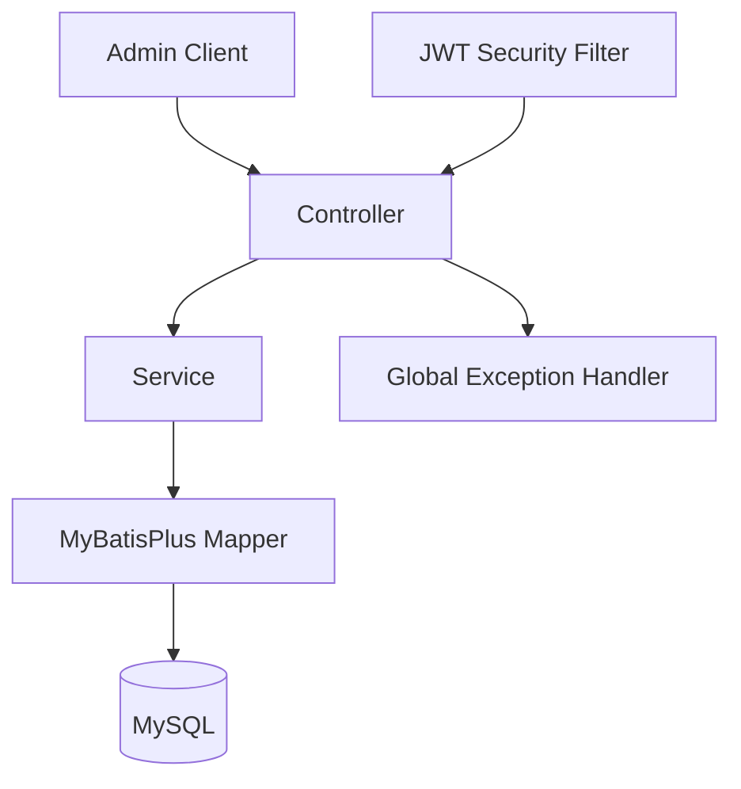

# Spring Boot 后台管理系统方案

## 目标

构建一个接近真实生产后台、但复杂度受控的 Java 服务端项目。你已有 Nest 经验，所以设计重点放在 Spring Boot 的分层、依赖注入、拦截器/过滤器、DTO、事务、MyBatis Plus 数据访问和权限模型。

默认技术栈：

- Java 17
- Maven
- Spring Boot 3.x
- MyBatis Plus
- MySQL 8
- Spring Security + JWT
- Knife4j/OpenAPI 文档
- Lombok
- Validation

## 模块范围

第一版只做后台管理核心能力：

- 认证：登录、退出语义、JWT 签发、当前用户信息
- 用户管理：用户 CRUD、状态启停、重置密码、分页查询
- 角色管理：角色 CRUD、角色分配菜单权限
- 菜单权限：菜单树、按钮权限标识、路由元信息
- 部门管理：部门树、用户归属部门
- 字典管理：字典类型、字典项，服务通用枚举数据
- 操作日志：记录关键后台操作，不做复杂审计平台
- 通用基础：统一响应、统一异常、分页、参数校验、SQL 初始化

不做这些，避免一开始变成垃圾桶项目：

- 多租户
- 微服务
- Redis 缓存
- MQ
- OAuth2 第三方登录
- 前端工程
- 工作流/报表/代码生成器

## 架构设计

采用经典分层，保持 Java 新手可读性：

建议包结构：

- `src/main/java/.../common`：统一响应、异常、分页、常量
- `src/main/java/.../config`：Spring Security、MyBatis Plus、OpenAPI 配置
- `src/main/java/.../security`：JWT、登录用户、权限校验
- `src/main/java/.../module/system`：用户、角色、菜单、部门、字典、日志
- `src/main/resources/mapper`：MyBatis XML，仅复杂 SQL 使用
- `src/main/resources/db`：初始化 SQL

## 权限模型

用 RBAC，足够真实，别过度设计。

核心关系：

- 用户属于部门
- 用户拥有多个角色
- 角色拥有多个菜单/按钮权限
- 菜单负责路由和层级
- 按钮权限使用字符串标识，例如 `system:user:add`

登录后 JWT 只放必要身份信息。权限集合从数据库查，后续如果需要缓存再加，现在不引入 Redis。

## 数据表

核心表：

- `sys_user`
- `sys_role`
- `sys_menu`
- `sys_dept`
- `sys_dict_type`
- `sys_dict_data`
- `sys_oper_log`
- `sys_user_role`
- `sys_role_menu`

通用字段：

- `id`
- `create_time`
- `update_time`
- `create_by`
- `update_by`
- `deleted`

MyBatis Plus 负责逻辑删除和自动填充。真实项目里这是基础能力，不该每个业务方法手写。

## 接口设计

第一批接口：

- `POST /auth/login`
- `GET /auth/me`
- `POST /auth/logout`
- `GET /system/users`
- `POST /system/users`
- `PUT /system/users/{id}`
- `DELETE /system/users/{id}`
- `PUT /system/users/{id}/password`
- `GET /system/roles`
- `POST /system/roles`
- `PUT /system/roles/{id}/menus`
- `GET /system/menus/tree`
- `GET /system/depts/tree`
- `GET /system/dict-types`
- `GET /system/dict-data`
- `GET /system/operation-logs`

接口风格保持 REST-ish，不追求形式主义。后台管理系统最重要的是清晰、稳定、好调试。

## 错误处理

统一异常，不搞隐藏 fallback。

- 参数错误：`400`
- 未登录：`401`
- 无权限：`403`
- 业务错误：明确错误码和消息
- 系统错误：返回通用消息，服务端打印日志

## 实施顺序

1. 创建 Maven Spring Boot 工程骨架
2. 接入 MyBatis Plus、MySQL、Validation、OpenAPI
3. 建立 common 基础层：响应、异常、分页、基础实体
4. 建立数据库表和初始化管理员账号
5. 实现 JWT 登录和 Spring Security 鉴权
6. 实现用户、角色、菜单权限
7. 实现部门、字典、操作日志
8. 补充最小可验证测试和启动说明

## 验证方式

- Maven 编译通过
- 应用能连接 MySQL 启动
- 初始化 SQL 可执行
- 登录能返回 JWT
- 带 JWT 能访问 `/auth/me`
- 无权限接口返回 `403`
- 用户、角色、菜单基础 CRUD 可跑通

## 默认取舍

推荐这个方案，不做更轻的 demo，也不做大而全脚手架。原因很简单：你不是零基础，需要的是从 Nest 迁移到 Java 实战工程，而不是看 Hello World。